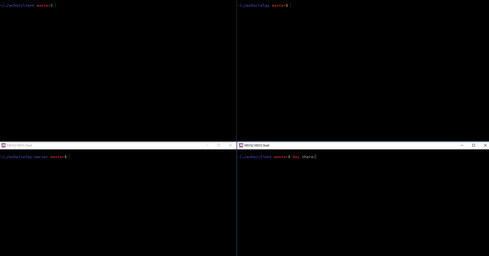

# The Overcomplicated Echo Server

This is Erich playing around with Rust's TCP functionality in the `std::net`
library and playing with some ideas. It may or may not also be for an
interview. ;)

## Usage

There are two major configurations in this project:
[relayed](#using-a-relayed-client-server-configuration) and
[non-relayed](#using-a-simple-client-server-configuration). This README will
cover high-level use cases.  For individual components in this project you can
use the `--help` flag for more specific documentation and usage.

### Using a simple client-server configuration

1. On your server, run `cargo run --bin server -- <port>`.

	Example: `cargo run --bin server -- 9001`

2. On your client, run `cargo run --bin client -- <server_addr>`

	Example: `cargo run --bin client -- 127.0.0.1:9001`

### Using a relayed client-server configuration

1. On your relay, run `cargo run --bin relay -- <incoming_port>
	<outgoing_port>`.

	Example: `cargo run --bin relay -- 9001 9002`

2. On your relayed server, run `cargo run --bin relay-server --
	<outgoing_relay_addr>`.

	Example: `cargo run --bin relay-server -- 127.0.0.1:9002`

3. On your client, run `cargo run --bin client -- <incoming_relay_addr>`

	Example: `cargo run --bin client -- 127.0.0.1:9001`

Here's a GIF of the example usage in action:

## Current limitations

Right now messages given to the echo server are limited to 128 bytes in length.
